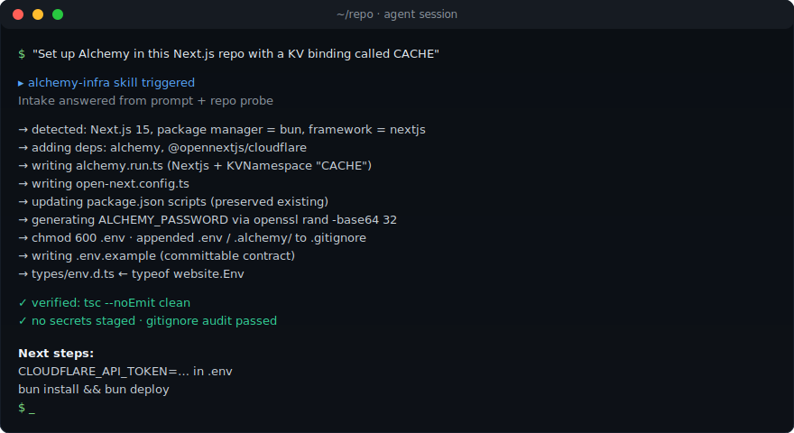
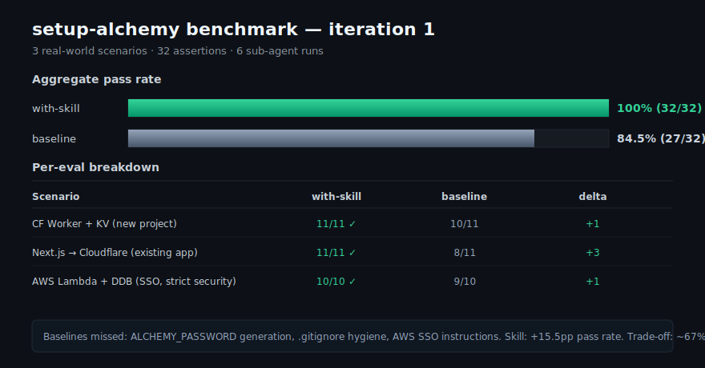
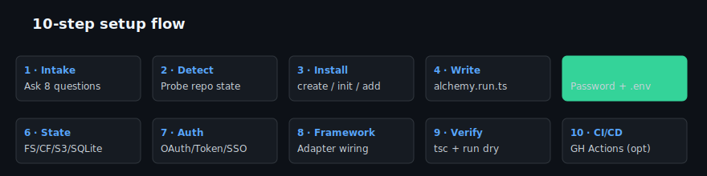
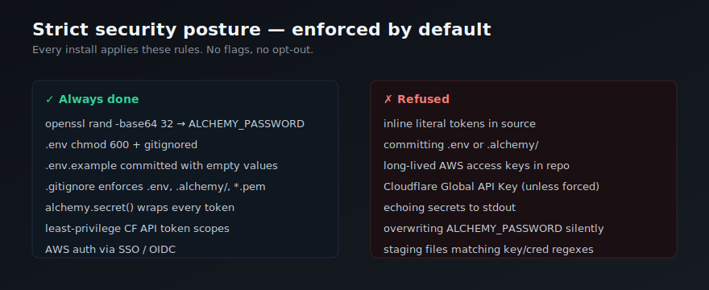

<div align="center">

# alchemy-infra

**Infrastructure-as-Code for agents. No dashboards, no clicking, no leaked secrets.**

The drop-in skill that lets any AI agent stand up real cloud infrastructure — Cloudflare Workers, KV, R2, D1, Queues, Durable Objects, AWS Lambda, DynamoDB — by writing TypeScript instead of navigating a UI.

[](LICENSE)
[](#-benchmark)
[](#-benchmark)
[](SKILL.md)
[](https://skills.sh)

[**Install**](#-install) · [**Demo**](#-demo) · [**Benchmark**](#-benchmark) · [**Security**](#-security) · [**FAQ**](#-faq)



</div>

---

## Why this exists

> **TL;DR** — Cloud UIs are click-prisons. Alchemy escapes them with TypeScript. But Alchemy itself takes 30+ correct decisions to set up safely. This skill encodes those decisions so any agent ships in one prompt.

### The pipeline

```
  🖱️  Cloud UIs  ──▶   📜  Alchemy (IaC-as-TS)  ──▶   🤖  alchemy-infra
  click-prison         escapes the UI                  makes setup safe
  agents can't use     but setup is 30+ decisions       for any agent
```

### Stage by stage

<table>
<tr>
<td width="33%" valign="top">

#### 🖱️ Cloud UIs — broken for agents

- 40 clicks per resource
- Dashboard drift on team edits
- Copy-pasted IDs go stale
- Agents physically can't navigate
- Humans don't want to

</td>
<td width="33%" valign="top">

#### 📜 Alchemy — fixes that

- Pure TypeScript, no DSL
- Resources are `await`-ed
- No YAML, no codegen
- Same file = source of truth
- *Cleanest IaC story today*

</td>
<td width="33%" valign="top">

#### 🤖 …but setup is a minefield

- Template? PM? File layout?
- Bindings per framework?
- `ALCHEMY_PASSWORD` rotation?
- `.gitignore` coverage?
- CI stage naming, state backend, SSO…

</td>
</tr>
</table>

### Where naive agents fail

| Footgun | Consequence | Baseline rate |
|---|---|---:|
| Inline a secret in `alchemy.run.ts` | Token shipped to GitHub | common |
| Skip `await app.finalize()` | Orphan resources, surprise bill | common |
| Forget to gitignore `.env` / `.alchemy/` | Secrets in git history | **3/3 baselines** |
| No `ALCHEMY_PASSWORD` generated | Future encryption silently breaks | **3/3 baselines** |
| Miss AWS SSO instructions | Opaque "credentials not found" at deploy | **1/1 AWS baseline** |

> Result: baseline agents fail **15.5 percentage points** of production-readiness checks. See [§ Benchmark](#-benchmark).

### What this skill is

**`alchemy-infra` = the playbook the Alchemy core team would write for agents.**

It encodes intake questions, security invariants, framework adapters, and state-backend selection into a single `SKILL.md`. Any SKILL.md-aware agent — Claude Code, Cursor, Aider, Cline, Codex, custom GPTs — reads it once and scaffolds production-ready Alchemy projects without ever touching a cloud console.

> **One prompt → deployable project.** Passwords generated, gitignore enforced, types wired, scripts ready.

---

## ✨ Demo


That entire interaction takes one prompt. The skill drives the intake, the detection, the writes, and the verify steps.

---

## 📊 Benchmark

Three real-world scenarios. 32 assertions. Side-by-side runs **with** and **without** the skill.



| Scenario | With skill | Baseline | Delta |
|---|---:|---:|---:|
| Cloudflare Worker + KV (new project) | **11/11** | 10/11 | +1 |
| Next.js → Cloudflare (existing app) | **11/11** | 8/11 | +3 |
| AWS Lambda + DynamoDB (SSO, strict security) | **10/10** | 9/10 | +1 |
| **Total** | **32/32 (100%)** | 27/32 (84.5%) | **+15.5pp** |

Where baselines failed:
- ❌ `ALCHEMY_PASSWORD` never generated (silent footgun — every secret you persist after this point is unrecoverable)
- ❌ `.gitignore` missing `.env`/`.alchemy/` (one careless `git add .` ships your token to GitHub)
- ❌ AWS SSO instructions missing (user gets opaque "credentials not found" at deploy)

Trade-off: **+67% tokens / +75% wall time** for production-ready output. We think that's an obviously good trade.

Re-run the benchmark anytime:
```bash
bash alchemy-infra-workspace/iteration-1/grade.sh
python3 alchemy-infra-workspace/iteration-1/aggregate.py
open alchemy-infra-workspace/iteration-1/review.html
```

---

## 🔄 The 10-step flow



Every install runs steps 1–9. Step 10 (CI/CD) is opt-in.

The skill **does not** start mutating files until step 3 confirms the plan with the user. No surprises.

---

## 🔐 Security



Full ruleset in [`references/security.md`](references/security.md). Highlights:

- `ALCHEMY_PASSWORD` is generated with `openssl rand -base64 32` (or Node `crypto.randomBytes` fallback). 32 bytes, base64. Written to `.env` with `chmod 600`. Never echoed to stdout.
- `.gitignore` is **idempotently** updated. The script also runs `git ls-files` to surface anything already tracked that shouldn't be.
- Cloudflare API tokens are minted with **least-privilege scopes** — Workers Scripts:Edit, KV/R2/D1/Queue:Edit, Account:Read. Global API Key is refused unless the user insists.
- AWS auth defaults to **SSO** (`AWS_PROFILE`). Long-lived `AKIA…` keys are never written to disk.
- Pre-commit safety: the skill scans for `.env`, `*.pem`, `*.key`, `credentials.json`, and common token regexes (`sk-`, `xoxb-`, `ghp_`, `AKIA…`) before any `git add`.

---

## 📦 Install

Pick the path that matches your tool.

### Claude Code via skills.sh
```bash
claude skill install https://github.com/aashirjaved/alchemy-infra
```

### Direct clone (works with Claude Code, Cursor, Aider, Cline, Codex)
```bash
# user-global
git clone https://github.com/aashirjaved/alchemy-infra.git \
  ~/.claude/skills/alchemy-infra

# project-local
git clone https://github.com/aashirjaved/alchemy-infra.git \
  ./.claude/skills/alchemy-infra
```

### npx — no Claude required
```bash
npx alchemy-infra install         # → ~/.claude/skills/alchemy-infra
npx alchemy-infra install --here  # → ./.claude/skills/alchemy-infra
npx alchemy-infra install --to ./agents/skills
```

The installer is a single dependency-free Node script. It copies the skill, preserves executable bits on shell scripts, and strips its own `bin/` + `package.json` from the installed copy.

### `.skill` archive (24 KB)

Download from [Releases](https://github.com/aashirjaved/alchemy-infra/releases), then in Claude Code:
```
/skills install alchemy-infra.skill
```

---

## 💬 Use

Once installed, your agent triggers the skill automatically on any prompt like:

> "Set up Alchemy in this Next.js repo with a KV binding."
> "I want to deploy a Cloudflare Worker with D1 in pure TypeScript."
> "Migrate this SST project to Alchemy."
> "Configure AWS Lambda + DynamoDB via Alchemy using my SSO profile."
> "Add a Cloudflare Queue and worker consumer to my existing alchemy.run.ts"

The agent asks the 8 intake questions, confirms the plan in 3–5 bullets, then executes.

---

## 🛠 What's inside

```
alchemy-infra/
├── SKILL.md                      # 232 lines · decision flow + invariants
├── README.md                     # this file
├── LICENSE                       # MIT
├── package.json                  # npx entry
├── bin/
│   └── install.js                # zero-dep installer
├── assets/                       # README diagrams (SVG)
├── references/                   # progressive disclosure — agent loads on demand
│   ├── cloudflare.md             # 97 lines · resource catalog
│   ├── aws.md                    # 70 lines · curated + aws-control
│   ├── frameworks.md             # 107 lines · Vite/Next/SvelteKit/Astro/Nuxt/TanStack
│   ├── security.md               # 76 lines · the strict ruleset
│   ├── cicd.md                   # 97 lines · GH Actions templates
│   ├── custom-resources.md       # 80 lines · authoring your own Resource
│   └── troubleshooting.md        # 62 lines · failure modes & fixes
├── scripts/                      # safe shell helpers — used by the skill
│   ├── gen_password.sh           # openssl rand → .env
│   ├── gitignore_check.sh        # enforce + audit tracked secrets
│   └── detect_project.sh         # read-only JSON probe of repo state
└── evals/
    └── evals.json                # benchmark prompts (for re-running)
```

Designed to stay small: SKILL.md < 500 lines, every reference < 300 lines.

---

## 🤝 Compatibility

| Tool / runtime | Status | How |
|---|---|---|
| Claude Code (CLI, IDE) | ✓ first-class | autoload from `~/.claude/skills/` |
| Claude.ai | ✓ | upload skill folder or `.skill` archive |
| Cursor | ✓ | point Cursor Rules at `SKILL.md` |
| Aider | ✓ | `/read SKILL.md` then chat |
| Cline / Continue | ✓ | reference SKILL.md from custom instructions |
| Codex CLI | ✓ | include SKILL.md in workspace |
| OpenAI Custom GPTs | ✓ | paste SKILL.md as system prompt; attach references/ |
| skills.sh registry | ✓ | frontmatter compliant |

---

## ❓ FAQ

<details>
<summary><strong>Will this overwrite my existing alchemy.run.ts?</strong></summary>

No. Step 1 always reads existing `alchemy.run.ts`, `wrangler.toml`, `sst.config.ts`, etc. If found, the skill switches to "modify in place" mode and confirms before any destructive change.
</details>

<details>
<summary><strong>What happens if I lose ALCHEMY_PASSWORD?</strong></summary>

Encrypted secrets in state become unrecoverable. There is no documented rotation procedure. The skill treats the password as permanent and refuses to silently overwrite an existing one — you'd have to remove the line manually first.
</details>

<details>
<summary><strong>Does this work with Bun? With Node? With pnpm/yarn/npm?</strong></summary>

All four. Bun is recommended by Alchemy upstream; everything else works. The skill reads your lockfile to detect package manager.
</details>

<details>
<summary><strong>Can I use this without Claude?</strong></summary>

Yes — SKILL.md is plain Markdown. Paste it as system prompt for any LLM, or load it as instructions in Cursor / Aider / Continue / Cline / Codex. The shell scripts and helper files are vanilla bash and Node, no Claude APIs.
</details>

<details>
<summary><strong>Does it support providers other than Cloudflare/AWS?</strong></summary>

Yes. The skill is cloud-agnostic — it asks during intake and loads `references/<provider>.md` if present. Cloudflare and AWS ship today; Neon, PlanetScale, Stripe, Vercel, GitHub, etc. are documented in [`references/cloudflare.md`](references/cloudflare.md) and the upstream [Alchemy docs](https://alchemy.run/providers/).
</details>

<details>
<summary><strong>How do I contribute?</strong></summary>

PRs welcome. Constraints: SKILL.md stays < 500 lines, every reference < 300 lines. Add new evals to `evals/evals.json` and re-run the benchmark before submitting.
</details>

---

## 📜 License

MIT — see [LICENSE](LICENSE). Use it, fork it, ship it.

---

<div align="center">

Built by [@aashirjaved](https://github.com/aashirjaved) · Powered by [Alchemy](https://github.com/alchemy-run/alchemy) · Distributed via [skills.sh](https://skills.sh)

**[Install now →](#-install)**

</div>
